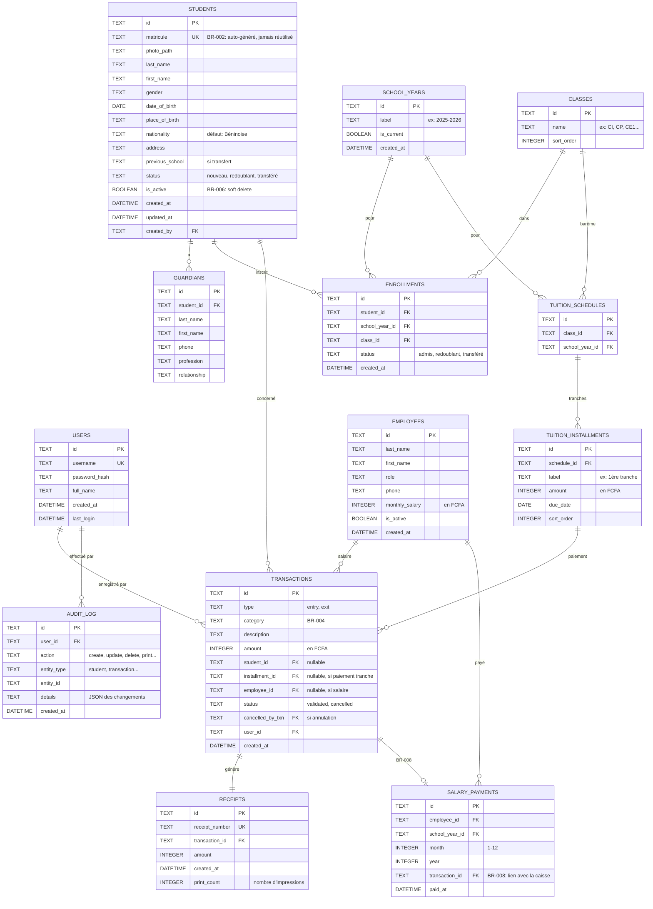

# ARCHITECTURE.md — AcademyFlow

Document d'architecture technique — Décisions technologiques, structure du projet et conventions.
Ce document complète le [SPEC.md](file:///e:/app/SPEC.md) qui décrit le QUOI ; ici on décrit le COMMENT.

---

## 1. Vue d'ensemble de la stack technique

| Couche | Technologie | Version cible | Justification |
|---|---|---|---|
| **Runtime desktop** | Electron | 33.x | Framework mature pour les apps desktop cross-platform, mais optimisé ici pour Windows. Permet d'empaqueter un exécutable `.exe` installable sans dépendance externe. Large écosystème, support natif de l'impression et de l'accès au système de fichiers. |
| **Frontend (UI)** | React | 19.x | Composant-driven, écosystème riche, excellente performance pour les interfaces données-intensives (tableaux, formulaires, dashboards). |
| **Bundler / Build** | Vite | 6.x | Build ultra-rapide en développement (HMR instantané) et production. Intégration native avec React et Electron via `electron-vite`. |
| **Langage** | TypeScript | 5.x | Typage statique pour réduire les bugs à la compilation, essentiel pour un projet avec des règles métier complexes (BR-001 à BR-010). |
| **Routing** | React Router | 7.x | Routing côté client pour la navigation entre modules (Élèves, Caisse, Personnel, Paramètres). |
| **State management** | Zustand | 5.x | Store léger, simple, sans boilerplate. Adapté à une app desktop mono-utilisateur. Redux serait overkill pour ce contexte. |
| **UI Components** | shadcn/ui + Radix UI | latest | Composants accessibles, non-opinionnés sur le style, entièrement personnalisables. Parfait pour construire une UI premium et cohérente. |
| **Styling** | Tailwind CSS | 4.x | Utilitaire-first, productivité maximale pour le styling, cohérence visuelle garantie via le design system. |
| **Tableaux de données** | TanStack Table | 8.x | Tri, filtrage, pagination performants. Essentiel pour les listes d'élèves, le journal de caisse, les rapports. |
| **Formulaires** | React Hook Form + Zod | latest | Validation déclarative avec schémas Zod alignés sur les règles métier. Performance optimale (rendu minimal). |
| **Graphiques** | Recharts | 2.x | Bibliothèque de charts React simple et efficace pour le tableau de bord financier (F-019). |
| **Base de données** | SQLite (via `better-sqlite3`) | latest | Base embarquée, zéro configuration, fichier unique. Parfait pour une app desktop mono-poste hors ligne. Performances excellentes pour la volumétrie cible (milliers d'élèves). |
| **ORM / Query builder** | Drizzle ORM | latest | ORM TypeScript léger, type-safe, avec support natif SQLite. Migrations intégrées. Alternative moderne et plus légère que Prisma. |
| **Génération PDF** | `@react-pdf/renderer` | latest | Génération de PDF côté client (reçus, attestations, certificats, rapports). Composants React pour les templates PDF. |
| **Impression thermique** | `node-thermal-printer` | latest | Pilotage direct des imprimantes thermiques ESC/POS depuis le processus principal Electron. Compatible avec les imprimantes de reçus courantes. |
| **Sauvegarde cloud** | Google Drive API (via `googleapis`) | latest | Sauvegarde automatique du fichier SQLite vers le cloud. Google Drive est accessible au Bénin et gratuit (15 Go). |
| **Authentification locale** | `bcryptjs` | latest | Hashage des mots de passe utilisateur stockés localement dans SQLite. |
| **Dates** | `date-fns` | 4.x | Manipulation de dates légère et modulaire (échéances de tranches, rapports par période). |
| **Packaging / Distribution** | `electron-builder` | latest | Génération d'installateurs Windows (`.exe` NSIS) prêts à distribuer. Auto-update optionnel. |

---

## 2. Architecture applicative

### 2.1 Modèle de processus Electron

```
┌─────────────────────────────────────────────────┐
│                  Main Process                    │
│              (Node.js / Electron)                │
│                                                  │
│  ┌──────────┐  ┌──────────┐  ┌───────────────┐  │
│  │ Database │  │ Printer  │  │ Cloud Backup  │  │
│  │ Service  │  │ Service  │  │   Service     │  │
│  └────┬─────┘  └────┬─────┘  └──────┬────────┘  │
│       │              │               │           │
│       └──────────────┼───────────────┘           │
│                      │                           │
│              ┌───────┴────────┐                  │
│              │   IPC Bridge   │                  │
│              │  (contextBridge │                  │
│              │   + preload)   │                  │
│              └───────┬────────┘                  │
└──────────────────────┼──────────────────────────┘
                       │
┌──────────────────────┼──────────────────────────┐
│              Renderer Process                    │
│              (React + Vite)                      │
│                                                  │
│  ┌──────────────────────────────────────────┐    │
│  │              React App                    │   │
│  │  ┌────────┐ ┌────────┐ ┌──────────────┐  │   │
│  │  │ Pages  │ │ Stores │ │  Components  │  │   │
│  │  └────────┘ └────────┘ └──────────────┘  │   │
│  └──────────────────────────────────────────┘    │
└──────────────────────────────────────────────────┘
```

**Main Process** — Gère les accès natifs : base de données SQLite, impression, système de fichiers, sauvegarde cloud. C'est le « backend » local de l'application.

**Renderer Process** — Affiche l'interface utilisateur React. Communique avec le Main Process exclusivement via l'IPC Bridge sécurisé (contextBridge / preload script).

**Preload Script** — Expose une API typée et sécurisée au renderer via `contextBridge.exposeInMainWorld`. Aucun accès direct à Node.js depuis le renderer (sécurité).

### 2.2 Communication IPC

```typescript
// Exemple de canal IPC typé
type IpcChannels = {
  // Élèves
  'students:create': (data: CreateStudentDTO) => Student;
  'students:update': (id: string, data: UpdateStudentDTO) => Student;
  'students:delete': (id: string) => void;
  'students:findById': (id: string) => Student | null;
  'students:search': (query: SearchQuery) => PaginatedResult<Student>;
  'students:listByClass': (classId: string, yearId: string) => Student[];

  // Caisse
  'cashbox:createEntry': (data: CreateTransactionDTO) => Transaction;
  'cashbox:getJournal': (filters: JournalFilters) => PaginatedResult<Transaction>;
  'cashbox:getStudentAccount': (studentId: string) => TuitionAccount;

  // Impression
  'printer:printReceipt': (receiptId: string) => PrintResult;
  'printer:testConnection': () => PrinterStatus;

  // Sauvegarde
  'backup:exportToCloud': () => BackupResult;
  'backup:getLastBackup': () => BackupInfo | null;
};
```

---

## 3. Structure du projet

```
e:\app\
├── SPEC.md                          # Spécification fonctionnelle (source de vérité)
├── ARCHITECTURE.md                  # Ce fichier
├── design.jpg                       # Maquette de référence
├── logo.png                         # Logo AcademyFlow
│
├── package.json                     # Dépendances et scripts
├── tsconfig.json                    # Configuration TypeScript
├── electron.vite.config.ts          # Configuration electron-vite
├── tailwind.config.ts               # Configuration Tailwind CSS
│
├── resources/                       # Ressources empaquetées (icônes, etc.)
│   ├── icon.ico                     # Icône Windows
│   └── icon.png                     # Icône haute résolution
│
├── src/
│   ├── main/                        # ── Main Process (Electron) ──
│   │   ├── index.ts                 # Point d'entrée Electron
│   │   ├── ipc/                     # Handlers IPC par domaine
│   │   │   ├── students.ipc.ts
│   │   │   ├── cashbox.ipc.ts
│   │   │   ├── personnel.ipc.ts
│   │   │   ├── settings.ipc.ts
│   │   │   ├── printer.ipc.ts
│   │   │   ├── backup.ipc.ts
│   │   │   └── auth.ipc.ts
│   │   │
│   │   ├── database/                # Couche base de données
│   │   │   ├── connection.ts        # Connexion SQLite (better-sqlite3)
│   │   │   ├── schema.ts            # Schéma Drizzle ORM
│   │   │   ├── migrations/          # Fichiers de migration SQL
│   │   │   └── seed.ts              # Données initiales (classes par défaut, etc.)
│   │   │
│   │   ├── services/                # Logique métier (règles BR-xxx)
│   │   │   ├── student.service.ts
│   │   │   ├── cashbox.service.ts
│   │   │   ├── tuition.service.ts   # Gestion des comptes de scolarité / arriérés
│   │   │   ├── personnel.service.ts
│   │   │   ├── receipt.service.ts   # Numérotation et traçabilité des reçus
│   │   │   ├── matricule.service.ts # Génération de matricules uniques (BR-002)
│   │   │   ├── audit.service.ts     # Traçabilité des actions (qui, quoi, quand)
│   │   │   └── backup.service.ts    # Sauvegarde cloud
│   │   │
│   │   └── printing/                # Pilotage impression
│   │       ├── thermal-printer.ts   # Abstraction imprimante thermique
│   │       └── templates/           # Templates d'impression ESC/POS
│   │           └── receipt.ts
│   │
│   ├── preload/                     # ── Preload Script ──
│   │   ├── index.ts                 # contextBridge — API exposée au renderer
│   │   └── api.d.ts                 # Types de l'API exposée
│   │
│   ├── renderer/                    # ── Renderer Process (React) ──
│   │   ├── index.html               # Point d'entrée HTML
│   │   ├── main.tsx                 # Bootstrap React
│   │   ├── App.tsx                  # Layout principal + Router
│   │   │
│   │   ├── assets/                  # Images, polices, etc.
│   │   │   └── logo.png
│   │   │
│   │   ├── styles/                  # Styles globaux
│   │   │   ├── globals.css          # Reset + variables CSS + Tailwind directives
│   │   │   └── print.css            # Styles spécifiques pour l'impression navigateur
│   │   │
│   │   ├── components/              # Composants réutilisables
│   │   │   ├── ui/                  # shadcn/ui components (Button, Input, Dialog, etc.)
│   │   │   ├── layout/              # Shell, Sidebar, Header, etc.
│   │   │   ├── data-table/          # Composant tableau générique (TanStack)
│   │   │   ├── forms/               # Composants de formulaire métier
│   │   │   └── charts/              # Composants graphiques (Recharts)
│   │   │
│   │   ├── pages/                   # Pages (1 par route principale)
│   │   │   ├── auth/
│   │   │   │   └── LoginPage.tsx
│   │   │   ├── dashboard/
│   │   │   │   └── DashboardPage.tsx        # F-019 — Tableau de bord financier
│   │   │   ├── students/
│   │   │   │   ├── StudentsListPage.tsx      # F-007, F-008
│   │   │   │   ├── StudentCreatePage.tsx     # F-001
│   │   │   │   ├── StudentDetailPage.tsx     # F-002, F-006, F-012
│   │   │   │   └── ClassPromotionPage.tsx    # F-004, F-005
│   │   │   ├── cashbox/
│   │   │   │   ├── CashboxJournalPage.tsx    # F-015, F-016
│   │   │   │   ├── NewTransactionPage.tsx    # F-013, F-014
│   │   │   │   ├── StudentAccountPage.tsx    # F-020, F-021
│   │   │   │   └── ReportsPage.tsx           # F-017
│   │   │   ├── personnel/
│   │   │   │   ├── PersonnelListPage.tsx     # F-022
│   │   │   │   └── SalaryTrackingPage.tsx    # F-023, F-024, F-025
│   │   │   └── settings/
│   │   │       ├── SchoolYearPage.tsx        # F-026
│   │   │       └── TuitionFeesPage.tsx       # F-027
│   │   │
│   │   ├── stores/                  # Zustand stores
│   │   │   ├── auth.store.ts
│   │   │   ├── students.store.ts
│   │   │   ├── cashbox.store.ts
│   │   │   ├── personnel.store.ts
│   │   │   └── settings.store.ts
│   │   │
│   │   ├── hooks/                   # Custom React hooks
│   │   │   ├── useStudents.ts
│   │   │   ├── useCashbox.ts
│   │   │   ├── usePrinter.ts
│   │   │   └── useDebounce.ts
│   │   │
│   │   ├── lib/                     # Utilitaires
│   │   │   ├── ipc.ts              # Wrapper typé pour les appels IPC
│   │   │   ├── formatters.ts       # Formatage monétaire (FCFA), dates
│   │   │   └── validators.ts       # Schémas Zod partagés
│   │   │
│   │   └── pdf/                     # Templates PDF (@react-pdf)
│   │       ├── ReceiptPDF.tsx       # F-018 — Reçu de paiement
│   │       ├── EnrollmentCertPDF.tsx # F-009 — Attestation d'inscription
│   │       ├── SchoolCertPDF.tsx    # F-010 — Certificat de scolarité
│   │       ├── StudentFilePDF.tsx   # F-012 — Fiche individuelle
│   │       ├── ClassListPDF.tsx     # F-011 — Liste de classe
│   │       ├── CashReportPDF.tsx    # F-017 — Rapport financier
│   │       └── SalaryReportPDF.tsx  # F-025 — État des salaires
│   │
│   └── shared/                      # ── Code partagé Main ↔ Renderer ──
│       ├── types/                   # Types TypeScript partagés
│       │   ├── student.types.ts
│       │   ├── transaction.types.ts
│       │   ├── personnel.types.ts
│       │   ├── settings.types.ts
│       │   └── common.types.ts
│       ├── constants/               # Constantes métier
│       │   ├── categories.ts        # Catégories de caisse (BR-004)
│       │   └── defaults.ts          # Nationalité par défaut, etc.
│       └── ipc-channels.ts          # Noms des canaux IPC (source unique)
│
└── dist/                            # Build de production (généré)
    └── win-unpacked/                # App Windows non empaquetée
```

---

## 4. Schéma de base de données

### 4.1 Diagramme entité-relation



### 4.2 Conventions

- **IDs** : UUIDs v7 (triables chronologiquement) générés via `crypto.randomUUID()`.
- **Montants** : stockés en **entiers** (centimes FCFA, bien que le FCFA n'ait pas de centimes — cela évite tout problème de flottants). 1 FCFA = 1 unité.
- **Soft delete** : les élèves et employés ne sont jamais physiquement supprimés (`is_active = false`), conformément à BR-006.
- **Horodatage** : toutes les dates sont stockées en ISO 8601 UTC.
- **Audit trail** : toute modification critique est enregistrée dans `AUDIT_LOG` avec l'ID utilisateur, l'action et le détail des changements.

---

## 5. Sécurité

### 5.1 Authentification

- Login local avec identifiant / mot de passe.
- Mots de passe hashés avec `bcryptjs` (coût 12).
- Session en mémoire dans le Main Process (pas de JWT, pas de token — c'est une app desktop mono-poste).
- Verrouillage automatique après inactivité configurable (15 min par défaut).

### 5.2 Sécurité Electron

- `nodeIntegration: false` — le renderer n'a pas accès à Node.js.
- `contextIsolation: true` — isolation complète entre le monde web et le preload.
- `sandbox: true` — renforcement de l'isolation du renderer.
- Communication exclusivement via `contextBridge` avec des canaux IPC nommés et typés.
- Pas de `remote` module (déprécié et dangereux).

### 5.3 Protection des données

- Le fichier SQLite est stocké dans `%APPDATA%/AcademyFlow/data/`.
- Sauvegarde cloud chiffrée optionnelle (Google Drive).
- Pas de données sensibles dans les logs.

---

## 6. Impression

### 6.1 Impression thermique (reçus — F-018)

```
┌──────────────┐     ESC/POS      ┌──────────────────┐
│ Main Process │ ──────────────── │ Imprimante       │
│ (node-       │    USB / Réseau  │ thermique 80mm   │
│  thermal-    │                  │ (POS-80, Epson   │
│  printer)    │                  │  TM-T20, etc.)   │
└──────────────┘                  └──────────────────┘
```

- Communication via `node-thermal-printer` (protocole ESC/POS).
- Connexion USB (la plus courante au Bénin) ou réseau. Note d'implémentation :
  seules les interfaces pures JavaScript de `node-thermal-printer` sont
  utilisées (`tcp://` pour le réseau, port/fichier local type `\\.\COM3`
  pour l'USB) — aucune dépendance native supplémentaire n'est introduite,
  ce qui évite tout risque de compilation cassée au packaging (§10).
- Template de reçu formaté pour papier 80mm :
  - En-tête : nom de l'école, logo (si supporté), adresse.
  - Corps : nom élève, classe, type de paiement, montant, détail des tranches.
  - Pied : numéro de reçu, date/heure, nom de l'opérateur.
- Fallback : si l'imprimante thermique n'est pas disponible, impression via le système Windows (imprimante standard) avec un template PDF A5.

### 6.2 Impression PDF (documents administratifs)

- Tous les documents administratifs (attestations, certificats, listes, rapports) sont générés en PDF via `@react-pdf/renderer`.
- Ouverture dans la visionneuse PDF du système, avec impression via le dialogue Windows standard.

---

## 7. Sauvegarde cloud

```
┌──────────────┐                     ┌──────────────┐
│ SQLite DB    │ ── export WAL ──▶  │ Fichier      │
│ (local)      │    checkpoint       │ .backup      │
└──────────────┘                     └──────┬───────┘
                                            │
                                     ┌──────▼───────┐
                                     │ Google Drive  │
                                     │ (dossier      │
                                     │  AcademyFlow) │
                                     └──────────────┘
```

- Sauvegarde du fichier SQLite complet (après checkpoint WAL, compressé en gzip) vers Google Drive.
- Authentification OAuth2 via le navigateur système (flux "installed app" : serveur
  HTTP loopback local `127.0.0.1` + PKCE, portée `drive.file` — l'application
  ne voit que ses propres fichiers). Jeton de rafraîchissement chiffré via
  `safeStorage` avant persistance. Identifiant d'application (Client ID/Secret)
  fourni par variables d'environnement développeur — voir `.env.example`.
- Fréquence configurable : quotidienne par défaut, déclenchable manuellement.
- Conservation des 7 dernières sauvegardes (rotation automatique).
- Restauration possible depuis les Paramètres : copie de sécurité locale de
  l'état actuel avant remplacement, puis redémarrage complet de l'application
  (une connexion SQLite ouverte ne peut pas être remplacée à chaud).

---

## 8. Design System & UI

### 8.1 Inspiration

L'interface s'inspire du design de référence fourni ([design.jpg](file:///e:/app/design.jpg)) : layout propre avec sidebar, dashboard avec KPIs en cartes, tableaux de données avec filtres, navigation par onglets.

### 8.2 Palette de couleurs

```css
/* Palette principale — inspirée du logo AcademyFlow */
--color-primary-50:  #FFF1F2;   /* Fond très léger */
--color-primary-100: #FFE4E6;
--color-primary-500: #F43F5E;   /* Accent principal — rose/corail du logo */
--color-primary-600: #E11D48;
--color-primary-700: #BE123C;

/* Accent secondaire — turquoise du logo */
--color-accent-400:  #22D3EE;
--color-accent-500:  #06B6D4;
--color-accent-600:  #0891B2;

/* Neutres — interface propre et professionnelle */
--color-gray-50:     #F8FAFC;
--color-gray-100:    #F1F5F9;
--color-gray-200:    #E2E8F0;
--color-gray-700:    #334155;
--color-gray-800:    #1E293B;
--color-gray-900:    #0F172A;

/* Sémantiques */
--color-success:     #22C55E;   /* Paiements reçus, statuts OK */
--color-warning:     #F59E0B;   /* Arriérés partiels */
--color-danger:      #EF4444;   /* Arriérés critiques, erreurs */
```

### 8.3 Typographie

- **Police principale** : `Inter` (Google Fonts) — moderne, très lisible, excellente pour les interfaces data-heavy.
- **Police numérique** : `JetBrains Mono` — pour les montants et matricules (lisibilité maximale des chiffres).

### 8.4 Layout principal

```
┌──────────────────────────────────────────────────────┐
│  Logo  │  AcademyFlow        │ 🔔  │  User  │ ⚙️   │
├────────┼─────────────────────────────────────────────┤
│        │                                             │
│  📊   │           Main Content Area                 │
│  Dash  │                                             │
│        │  ┌─────────────────────────────────────┐    │
│  🎓   │  │                                     │    │
│ Élèves │  │         Page Content                │    │
│        │  │         (tables, forms,             │    │
│  💰   │  │          charts, etc.)              │    │
│ Caisse │  │                                     │    │
│        │  └─────────────────────────────────────┘    │
│  👥   │                                             │
│ Person.│                                             │
│        │                                             │
│  ⚙️   │                                             │
│ Param. │                                             │
│        │                                             │
├────────┼─────────────────────────────────────────────┤
│        │  AcademyFlow v1.0 — Année scolaire 2025-26 │
└────────┴─────────────────────────────────────────────┘
```

- **Sidebar fixe** à gauche (collapsible) avec icônes et labels pour chaque module.
- **Header** avec le nom de l'établissement, notifications, profil utilisateur.
- **Zone de contenu** scrollable avec breadcrumbs.
- **Footer** discret avec la version et l'année scolaire en cours.

---

## 9. Scripts NPM

```json
{
  "scripts": {
    "dev": "electron-vite dev",
    "build": "electron-vite build",
    "preview": "electron-vite preview",
    "package": "electron-builder --win --config",
    "db:generate": "drizzle-kit generate",
    "db:migrate": "drizzle-kit migrate",
    "db:studio": "drizzle-kit studio",
    "lint": "eslint . --ext .ts,.tsx",
    "typecheck": "tsc --noEmit"
  }
}
```

---

## 10. Configuration de build & distribution

### 10.1 electron-builder

```yaml
# electron-builder.yml
appId: com.academyflow.app
productName: AcademyFlow
copyright: Copyright © 2026 AcademyFlow

win:
  target:
    - target: nsis
      arch: [x64]
  icon: resources/icon.ico

nsis:
  oneClick: false
  perMachine: true
  allowToChangeInstallationDirectory: true
  installerIcon: resources/icon.ico
  uninstallerIcon: resources/icon.ico
  shortcutName: AcademyFlow
  createDesktopShortcut: true
  createStartMenuShortcut: true

directories:
  output: release
```

### 10.2 Emplacement des données utilisateur

```
%APPDATA%/AcademyFlow/
├── data/
│   └── academyflow.db          # Base de données SQLite
├── backups/
│   └── academyflow_2026-08-14.db  # Sauvegardes locales
├── logs/
│   └── app.log                 # Logs de l'application
└── config.json                 # Préférences utilisateur
```

---

## 11. Gestion des devises

- **Devise unique** : Franc CFA (XOF), conformément à A-005.
- **Stockage** : entiers (pas de décimales pour le FCFA).
- **Affichage** : formatage avec séparateur de milliers (espace) et suffixe « F CFA ».
  - Exemple : `150 000 F CFA`.
- **Fonction utilitaire** :
  ```typescript
  export function formatCFA(amount: number): string {
    return `${amount.toLocaleString('fr-FR')} F CFA`;
  }
  ```

---

## 12. Conventions de développement

### 12.1 Nommage

| Élément | Convention | Exemple |
|---|---|---|
| Fichiers composants | PascalCase | `StudentCreatePage.tsx` |
| Fichiers utilitaires | kebab-case | `matricule.service.ts` |
| Variables / fonctions | camelCase | `getStudentById()` |
| Types / Interfaces | PascalCase | `CreateStudentDTO` |
| Constantes | UPPER_SNAKE_CASE | `MAX_INSTALLMENTS` |
| Tables SQL | UPPER_SNAKE_CASE pluriel | `STUDENTS`, `TRANSACTIONS` |
| Colonnes SQL | snake_case | `first_name`, `created_at` |

### 12.2 Commits

Format : `type(scope): description`

Types : `feat`, `fix`, `refactor`, `style`, `docs`, `test`, `chore`.

Exemples :
- `feat(students): add enrollment form with validation`
- `fix(cashbox): correct balance calculation for partial payments`

### 12.3 Règles de code

- Pas de `any` en TypeScript sauf cas exceptionnel documenté.
- Toutes les règles métier (BR-xxx) sont implémentées dans la couche `services/` du Main Process, jamais dans le renderer.
- Toute interaction avec la BDD passe par les services, jamais d'accès direct depuis les handlers IPC.
- Les composants React sont purement présentationnels ; la logique métier est dans les stores et les services.

---

## 13. Plan de vérification

| Aspect | Méthode | Outil |
|---|---|---|
| Typage | Vérification statique | TypeScript `tsc --noEmit` |
| Linting | Analyse statique | ESLint + Prettier |
| Règles métier | Tests unitaires | Vitest |
| Services BDD | Tests d'intégration | Vitest + SQLite in-memory |
| UI Composants | Tests de rendu | Vitest + Testing Library |
| Parcours utilisateur | Tests E2E | Playwright + Electron |
| Build Windows | Build de production | `electron-builder` CI |

---

## 14. Dépendances principales

```json
{
  "dependencies": {
    "react": "^19.0.0",
    "react-dom": "^19.0.0",
    "react-router-dom": "^7.0.0",
    "zustand": "^5.0.0",
    "better-sqlite3": "^11.0.0",
    "drizzle-orm": "^0.36.0",
    "@react-pdf/renderer": "^4.0.0",
    "node-thermal-printer": "^4.0.0",
    "react-hook-form": "^7.0.0",
    "zod": "^3.0.0",
    "@hookform/resolvers": "^3.0.0",
    "@tanstack/react-table": "^8.0.0",
    "recharts": "^2.0.0",
    "date-fns": "^4.0.0",
    "bcryptjs": "^2.0.0",
    "googleapis": "^144.0.0",
    "@radix-ui/react-dialog": "^1.0.0",
    "@radix-ui/react-dropdown-menu": "^2.0.0",
    "@radix-ui/react-select": "^2.0.0",
    "@radix-ui/react-toast": "^1.0.0",
    "lucide-react": "^0.460.0",
    "clsx": "^2.0.0",
    "tailwind-merge": "^2.0.0"
  },
  "devDependencies": {
    "electron": "^33.0.0",
    "electron-vite": "^3.0.0",
    "electron-builder": "^25.0.0",
    "typescript": "^5.0.0",
    "vite": "^6.0.0",
    "@vitejs/plugin-react": "^4.0.0",
    "tailwindcss": "^4.0.0",
    "drizzle-kit": "^0.30.0",
    "eslint": "^9.0.0",
    "prettier": "^3.0.0",
    "vitest": "^2.0.0",
    "@testing-library/react": "^16.0.0",
    "playwright": "^1.0.0"
  }
}
```

---

## 15. Justification des choix clés

### Pourquoi Electron plutôt que Tauri ?

| Critère | Electron | Tauri |
|---|---|---|
| Maturité | ✅ 10+ ans, très stable | ⚠️ Plus récent |
| Écosystème NPM natif | ✅ `better-sqlite3`, `node-thermal-printer` fonctionnent directement | ❌ Nécessite des bindings Rust pour chaque lib native |
| Impression thermique | ✅ `node-thermal-printer` prêt à l'emploi | ❌ Pas d'équivalent Rust mature |
| Taille de l'installateur | ❌ ~80-120 Mo | ✅ ~10-20 Mo |
| RAM | ❌ ~150-250 Mo | ✅ ~30-50 Mo |
| Support communautaire | ✅ Massive | ⚠️ Croissant |

**Verdict** : Electron est choisi pour la **compatibilité directe avec `node-thermal-printer`** (exigence critique de F-018) et la **maturité de l'écosystème**. La taille de l'installateur et la consommation mémoire sont acceptables pour un logiciel installé sur un poste fixe dédié.

### Pourquoi SQLite plutôt que PostgreSQL ?

- **Zéro installation** : pas de serveur de base de données à installer/configurer/maintenir.
- **Mono-poste** : l'application est destinée à un seul poste par établissement — pas besoin de base partagée.
- **Hors ligne** : SQLite fonctionne entièrement sans réseau.
- **Sauvegarde triviale** : un seul fichier à copier vers le cloud.
- **Performance** : largement suffisante pour quelques milliers d'élèves et quelques dizaines de milliers de transactions par an.

### Pourquoi Drizzle ORM plutôt que Prisma ?

- **Léger** : pas de moteur binaire supplémentaire (Prisma embarque un query engine Rust de ~15 Mo).
- **Type-safe** : inférence TypeScript native.
- **SQL-close** : les requêtes Drizzle ressemblent au SQL, facilitant le debug.
- **SQLite first-class** : support natif excellent avec `better-sqlite3`.

---

> **Ce document est vivant.** Il sera mis à jour au fur et à mesure de l'avancement du projet pour refléter les décisions techniques prises en cours de développement.
