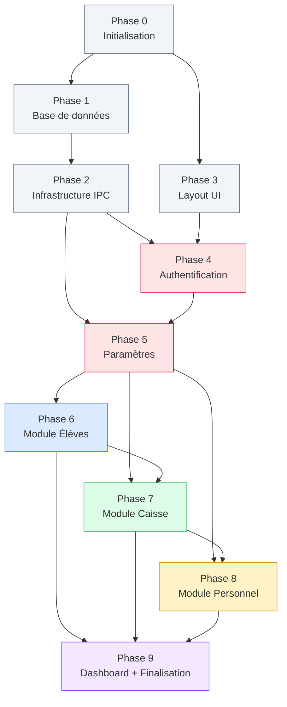

# Plan d'implémentation — AcademyFlow

Plan détaillé pour l'implémentation complète du MVP d'AcademyFlow, basé sur [SPEC.md](file:///e:/app/SPEC.md) et [ARCHITECTURE.md](file:///e:/app/ARCHITECTURE.md).

> [!IMPORTANT]
> Ce plan est séquentiel : chaque phase dépend des précédentes. Les phases sont conçues pour produire un résultat testable à chaque étape.

---

## Phase 0 — Initialisation du projet

**Objectif** : Scaffolding complet du projet Electron + Vite + React + TypeScript + Tailwind. L'application démarre et affiche une fenêtre vide.

### Étapes

#### 0.1 — Scaffolding Electron-Vite

- Initialiser le projet avec `electron-vite` (template React + TypeScript)
- Configurer `electron.vite.config.ts`
- Structure initiale des dossiers `src/main/`, `src/preload/`, `src/renderer/`, `src/shared/`

#### 0.2 — Configuration TypeScript

- `tsconfig.json` (racine) + `tsconfig.node.json` (main) + `tsconfig.web.json` (renderer)
- Chemins d'alias (`@main/`, `@renderer/`, `@shared/`, `@preload/`)
- Mode strict activé

#### 0.3 — Tailwind CSS + Design System de base

- Installer et configurer Tailwind CSS v4
- Créer `src/renderer/styles/globals.css` avec les variables CSS du design system (palette, typographie)
- Importer Google Fonts : `Inter` et `JetBrains Mono`

#### 0.4 — shadcn/ui

- Installer et configurer shadcn/ui (composants de base)
- Installer les composants fondamentaux : `Button`, `Input`, `Label`, `Card`, `Dialog`, `Select`, `Table`, `Toast`, `DropdownMenu`, `Separator`, `Badge`, `Tabs`, `Tooltip`, `Sheet`
- Configurer `cn()` utility (`clsx` + `tailwind-merge`)

#### 0.5 — ESLint + Prettier

- Configurer ESLint 9 (flat config) avec rules TypeScript + React
- Configurer Prettier
- Script `lint` et `format`

#### 0.6 — electron-builder

- Créer `electron-builder.yml` pour le packaging Windows (NSIS)
- Copier le logo dans `resources/icon.ico` et `resources/icon.png`

### Fichiers créés

| Fichier | Description |
|---|---|
| `package.json` | Dépendances et scripts |
| `electron.vite.config.ts` | Config build Electron + Vite |
| `electron-builder.yml` | Config packaging Windows |
| `tsconfig.json`, `tsconfig.node.json`, `tsconfig.web.json` | Configs TypeScript |
| `eslint.config.js` | Config ESLint |
| `.prettierrc` | Config Prettier |
| `tailwind.config.ts` | Config Tailwind (si nécessaire avec v4) |
| `src/renderer/styles/globals.css` | Variables CSS, Tailwind directives, polices |
| `src/renderer/main.tsx` | Bootstrap React |
| `src/renderer/index.html` | Point d'entrée HTML |
| `src/renderer/App.tsx` | Composant racine (placeholder) |
| `src/main/index.ts` | Point d'entrée Electron |
| `src/preload/index.ts` | Preload script (contextBridge vide) |
| `resources/icon.ico`, `resources/icon.png` | Icônes de l'application |

### Validation

- `npm run dev` → la fenêtre Electron s'ouvre avec le contenu React
- `npm run build` → build de production sans erreur
- `npm run typecheck` → aucune erreur TypeScript

---

## Phase 1 — Base de données et ORM

**Objectif** : Schéma de base de données complet avec Drizzle ORM, migrations, et données initiales. La BDD est créée automatiquement au premier lancement.

### Étapes

#### 1.1 — Connexion SQLite

- Installer `better-sqlite3` + `@types/better-sqlite3`
- Créer `src/main/database/connection.ts` : ouverture du fichier SQLite dans `%APPDATA%/AcademyFlow/data/`
- Activer le mode WAL, les foreign keys, et le journal mode

#### 1.2 — Schéma Drizzle ORM

- Installer `drizzle-orm` + `drizzle-kit`
- Créer `src/main/database/schema.ts` avec toutes les tables :

| Table | Entité SPEC | Champs clés |
|---|---|---|
| `users` | Utilisateurs | `id`, `username`, `password_hash`, `full_name` |
| `school_years` | Année scolaire | `id`, `label`, `is_current` |
| `classes` | Classes | `id`, `name`, `sort_order` |
| `students` | Élèves | `id`, `matricule` (UK), `last_name`, `first_name`, `gender`, `date_of_birth`, `place_of_birth`, `nationality`, `address`, `previous_school`, `photo_path`, `is_active` |
| `guardians` | Responsables | `id`, `student_id` (FK), `last_name`, `first_name`, `phone`, `profession`, `relationship` |
| `enrollments` | Inscriptions | `id`, `student_id` (FK), `school_year_id` (FK), `class_id` (FK), `status` |
| `tuition_schedules` | Barèmes | `id`, `class_id` (FK), `school_year_id` (FK) |
| `tuition_installments` | Tranches | `id`, `schedule_id` (FK), `label`, `amount`, `due_date`, `sort_order` |
| `transactions` | Opérations de caisse | `id`, `type`, `category`, `description`, `amount`, `student_id` (FK nullable), `installment_id` (FK nullable), `employee_id` (FK nullable), `status`, `cancelled_by_txn`, `user_id` (FK) |
| `receipts` | Reçus | `id`, `receipt_number` (UK), `transaction_id` (FK), `amount`, `print_count` |
| `employees` | Personnel | `id`, `last_name`, `first_name`, `role`, `phone`, `monthly_salary`, `is_active` |
| `salary_payments` | Paiements salaires | `id`, `employee_id` (FK), `school_year_id` (FK), `month`, `year`, `transaction_id` (FK) |
| `audit_log` | Journal d'audit | `id`, `user_id` (FK), `action`, `entity_type`, `entity_id`, `details` |

#### 1.3 — Migrations

- Configurer `drizzle.config.ts`
- Générer la migration initiale (`npm run db:generate`)
- Créer le mécanisme d'auto-migration au démarrage de l'app

#### 1.4 — Seed (données initiales)

- Créer `src/main/database/seed.ts` :
  - Classes par défaut du système éducatif béninois : CI, CP, CE1, CE2, CM1, CM2 (primaire) + 6ème à Tle (secondaire)
  - Utilisateur admin par défaut (`admin` / mot de passe à changer au premier lancement)
  - Première année scolaire par défaut

### Fichiers créés

| Fichier | Description |
|---|---|
| `src/main/database/connection.ts` | Connexion SQLite + configuration |
| `src/main/database/schema.ts` | Schéma Drizzle complet |
| `src/main/database/seed.ts` | Données initiales |
| `src/main/database/migrations/` | Fichiers de migration auto-générés |
| `drizzle.config.ts` | Configuration Drizzle Kit |

### Validation

- Au lancement, le fichier `academyflow.db` est créé dans `%APPDATA%/AcademyFlow/data/`
- Les tables sont créées avec les colonnes attendues
- Le seed insère les classes et l'utilisateur admin
- `npm run db:studio` → les données sont visibles dans Drizzle Studio

---

## Phase 2 — Infrastructure IPC et services de base

**Objectif** : Mettre en place le pont IPC typé entre Main et Renderer, et les services utilitaires transversaux (audit, matricule).

### Étapes

#### 2.1 — Types partagés

- Créer `src/shared/types/` avec les types TypeScript pour chaque entité
- Créer les DTOs (Data Transfer Objects) pour les opérations CRUD
- Créer `src/shared/ipc-channels.ts` : enum/objet avec tous les noms de canaux IPC
- Créer `src/shared/constants/categories.ts` : catégories de caisse (BR-004)
- Créer `src/shared/constants/defaults.ts` : nationalité par défaut, etc.

#### 2.2 — Preload API typée

- Compléter `src/preload/index.ts` avec `contextBridge.exposeInMainWorld`
- Créer `src/preload/api.d.ts` : déclaration TypeScript de l'API exposée au renderer
- Organiser l'API par domaine : `window.api.students.*`, `window.api.cashbox.*`, etc.

#### 2.3 — Handlers IPC (structure)

- Créer `src/main/ipc/register-all.ts` : enregistrement centralisé de tous les handlers
- Créer les fichiers handlers vides (squelette) pour chaque domaine :
  - `students.ipc.ts`
  - `cashbox.ipc.ts`
  - `personnel.ipc.ts`
  - `settings.ipc.ts`
  - `auth.ipc.ts`
  - `printer.ipc.ts`
  - `backup.ipc.ts`

#### 2.4 — Services transversaux

- `src/main/services/audit.service.ts` : enregistrement de toute action dans `audit_log` (traçabilité)
- `src/main/services/matricule.service.ts` : génération de matricules uniques (BR-002)
  - Format proposé : `AF-{ANNÉE}-{SÉQUENCE_5_CHIFFRES}` (ex: `AF-2026-00001`)
  - Séquence auto-incrémentée, jamais réutilisée même après suppression

#### 2.5 — Wrapper IPC côté renderer

- Créer `src/renderer/lib/ipc.ts` : wrapper typé pour les appels `window.api.*`

### Fichiers créés

| Fichier | Description |
|---|---|
| `src/shared/types/student.types.ts` | Types élèves + DTOs |
| `src/shared/types/transaction.types.ts` | Types caisse + DTOs |
| `src/shared/types/personnel.types.ts` | Types personnel + DTOs |
| `src/shared/types/settings.types.ts` | Types paramètres + DTOs |
| `src/shared/types/common.types.ts` | Types communs (pagination, résultats, etc.) |
| `src/shared/ipc-channels.ts` | Noms des canaux IPC |
| `src/shared/constants/categories.ts` | Catégories de caisse |
| `src/shared/constants/defaults.ts` | Valeurs par défaut |
| `src/preload/index.ts` | contextBridge complet |
| `src/preload/api.d.ts` | Types de l'API exposée |
| `src/main/ipc/register-all.ts` | Enregistrement centralisé |
| `src/main/ipc/*.ipc.ts` | Handlers IPC (squelettes) |
| `src/main/services/audit.service.ts` | Service d'audit |
| `src/main/services/matricule.service.ts` | Génération de matricules |
| `src/renderer/lib/ipc.ts` | Wrapper IPC renderer |

### Validation

- Appel IPC aller-retour fonctionnel (test avec un handler ping/pong)
- TypeScript valide les types de bout en bout (main → preload → renderer)
- `npm run typecheck` → aucune erreur

---

## Phase 3 — Layout UI et Design System

**Objectif** : Interface principale (shell) avec top bar de navigation horizontale (pas de sidebar), et routing. L'app a l'apparence d'un produit fini même sans contenu.

### Étapes

#### 3.1 — Layout principal

- Créer `src/renderer/components/layout/AppShell.tsx` : layout principal (topbar + content, sans sidebar), sur le modèle de la maquette de référence (dashboard type « Sypher ») :
  - Ligne supérieure : logo/nom de l'app à gauche, liens de navigation horizontaux centrés (Dashboard, Élèves, Caisse, Personnel, Paramètres…), bouton d'action principal (ex. « Générer un rapport ») + avatar utilisateur à droite
  - Contenu de la page en pleine largeur en dessous
- Créer `src/renderer/components/layout/TopNav.tsx` : navigation horizontale avec icônes (Lucide React)
  - Liens : Dashboard, Élèves, Caisse, Personnel, Paramètres
  - Les sous-menus par menu seront en dropdown
  - Indicateur visuel du lien actif (soulignement, comme dans la maquette)
- Créer `src/renderer/components/layout/Header.tsx` : en-tête / barre secondaire avec :

  - Année scolaire en cours
  - Profil utilisateur + menu dropdown (,   - Nom de l'établissement (depuis les paramètres), déconnexion)
  - Icône de notification 
- Créer `src/renderer/components/layout/Breadcrumbs.tsx`

#### 3.2 — Routing

- Configurer React Router dans `App.tsx`
- Routes :
  - `/login` — page de connexion
  - `/` — redirection vers `/dashboard`
  - `/dashboard` — tableau de bord
  - `/students` — liste des élèves
  - `/students/new` — inscription
  - `/students/:id` — détail élève
  - `/students/promotion` — passage de classe
  - `/cashbox` — journal de caisse
  - `/cashbox/new` — nouvelle opération
  - `/cashbox/student/:id` — compte élève
  - `/cashbox/reports` — rapports financiers
  - `/personnel` — liste du personnel
  - `/personnel/salaries` — suivi des salaires
  - `/settings` — paramètres (année scolaire + barème)
- Créer des pages placeholder pour chaque route

#### 3.3 — Composant DataTable générique

- Créer `src/renderer/components/data-table/DataTable.tsx` basé sur TanStack Table
- Fonctionnalités : tri par colonnes, filtrage, pagination, sélection de lignes
- Réutilisable dans tous les modules (listes d'élèves, journal de caisse, personnel)

#### 3.4 — Composants formulaire métier

- Créer `src/renderer/components/forms/FormField.tsx` : wrapper pour les champs de formulaire (label + input + erreur)
- Créer `src/renderer/components/forms/MoneyInput.tsx` : input spécialisé pour les montants en FCFA (formatage automatique)
- Créer `src/renderer/components/forms/DatePickerField.tsx` : sélecteur de date
- Créer `src/renderer/components/forms/SearchInput.tsx` : input avec icône de recherche et debounce

#### 3.5 — Utilitaires de formatage

- Créer `src/renderer/lib/formatters.ts` :
  - `formatCFA(amount)` → `150 000 F CFA`
  - `formatDate(date)` → `14 août 2026`
  - `formatDateTime(date)` → `14 août 2026 à 15:30`
  - `formatMatricule(matricule)` → chiffre numérique de 8 chiffres. Ex :10052724

### Fichiers créés

| Fichier | Description |
|---|---|
| `src/renderer/components/layout/AppShell.tsx` | Layout principal |
| `src/renderer/components/layout/TopNav.tsx` | Navigation horizontale (top bar) |
| `src/renderer/components/layout/Header.tsx` | En-tête / barre secondaire |
| `src/renderer/components/layout/Breadcrumbs.tsx` | Fil d'Ariane |
| `src/renderer/components/data-table/DataTable.tsx` | Tableau de données générique |
| `src/renderer/components/data-table/DataTablePagination.tsx` | Pagination |
| `src/renderer/components/data-table/DataTableToolbar.tsx` | Barre d'outils (filtres, recherche) |
| `src/renderer/components/forms/FormField.tsx` | Champ de formulaire |
| `src/renderer/components/forms/MoneyInput.tsx` | Input montant FCFA |
| `src/renderer/components/forms/DatePickerField.tsx` | Sélecteur de date |
| `src/renderer/components/forms/SearchInput.tsx` | Recherche avec debounce |
| `src/renderer/App.tsx` | Router + Layout |
| `src/renderer/pages/*/` | Pages placeholder |
| `src/renderer/lib/formatters.ts` | Fonctions de formatage |
| `src/renderer/hooks/useDebounce.ts` | Hook debounce |

### Validation

- Navigation fluide entre toutes les pages via la top bar
- Lien actif visuellement mis en évidence dans la top bar
- Breadcrumbs à jour sur chaque page
- Design premium : palette de couleurs du logo, animations de transition, hover effects
- Responsive au redimensionnement de la fenêtre Electron

---

## Phase 4 — Authentification

**Objectif** : Login fonctionnel, protection des routes, session avec verrouillage automatique.

### Étapes

#### 4.1 — Service d'authentification (Main Process)

- Créer `src/main/services/auth.service.ts` :
  - `login(username, password)` : vérification bcrypt, retour des infos utilisateur
  - `changePassword(userId, oldPassword, newPassword)`
  - `createUser(data)` : création d'un nouvel utilisateur
  - `getCurrentSession()` : session en mémoire
  - `logout()` : destruction de la session

#### 4.2 — Handlers IPC auth

- Compléter `src/main/ipc/auth.ipc.ts` avec les handlers :
  - `auth:login`
  - `auth:logout`
  - `auth:getCurrentUser`
  - `auth:changePassword`

#### 4.3 — Page de connexion

- Créer `src/renderer/pages/auth/LoginPage.tsx` :
  - Formulaire avec champ identifiant et mot de passe
  - Logo AcademyFlow centré
  - Gestion des erreurs (identifiants invalides)
  - Animation d'entrée
- Design premium : fond dégradé, carte centrée avec glassmorphism

#### 4.4 — Store et garde d'authentification

- Créer `src/renderer/stores/auth.store.ts` (Zustand)
- Créer `src/renderer/components/layout/AuthGuard.tsx` : redirige vers `/login` si non connecté
- Intégrer le verrouillage automatique après 15 min d'inactivité (détection d'événements souris/clavier)

#### 4.5 — Changement de mot de passe obligatoire

- Au premier login avec le compte admin par défaut, forcer le changement de mot de passe
- Dialog modal de changement de mot de passe

### Fichiers créés / modifiés

| Fichier | Action | Description |
|---|---|---|
| `src/main/services/auth.service.ts` | NEW | Service d'authentification |
| `src/main/ipc/auth.ipc.ts` | MODIFY | Handlers IPC auth |
| `src/renderer/pages/auth/LoginPage.tsx` | NEW | Page de connexion |
| `src/renderer/stores/auth.store.ts` | NEW | Store auth Zustand |
| `src/renderer/components/layout/AuthGuard.tsx` | NEW | Protection des routes |
| `src/renderer/App.tsx` | MODIFY | Intégration AuthGuard |

### Fonctionnalités SPEC couvertes

- A-003 (authentification requise)
- Section 9 — Sécurité (traçabilité via user_id)

### Validation

- Login avec `admin` / mot de passe par défaut → accès accordé
- Login avec mauvais identifiants → message d'erreur clair
- Accès direct à `/dashboard` sans login → redirection vers `/login`
- Après 15 min d'inactivité → retour à l'écran de connexion
- Premier login admin → obligation de changer le mot de passe

---

## Phase 5 — Module Paramètres

**Objectif** : Configuration de l'année scolaire et du barème des frais de scolarité par classe. Ce module est implémenté en premier car les autres modules en dépendent.

### Étapes

#### 5.1 — Service paramètres (Main Process)

- Créer `src/main/services/settings.service.ts` :
  - `getCurrentSchoolYear()` : année scolaire active
  - `createSchoolYear(label)` : création d'une nouvelle année
  - `setCurrentSchoolYear(yearId)` : activation d'une année
  - `getClasses()` : liste des classes
  - `getTuitionSchedule(classId, yearId)` : barème d'une classe
  - `saveTuitionSchedule(classId, yearId, installments[])` : sauvegarde du barème

#### 5.2 — Handlers IPC paramètres

- Compléter `src/main/ipc/settings.ipc.ts`

#### 5.3 — Page Année scolaire (F-026)

- Créer `src/renderer/pages/settings/SchoolYearPage.tsx` :
  - Liste des années scolaires avec indicateur de l'année active
  - Bouton « Nouvelle année scolaire » avec dialog de création
  - Bouton « Activer » pour changer l'année en cours
  - Confirmation avant changement d'année active

#### 5.4 — Page Barème des frais (F-027)

- Créer `src/renderer/pages/settings/TuitionFeesPage.tsx` :
  - Sélecteur de classe
  - Formulaire dynamique pour les tranches (ajouter/supprimer des tranches)
  - Champs par tranche : label, montant (FCFA), date d'échéance
  - Bouton sauvegarder
  - Affichage du total des frais pour la classe

#### 5.5 — Store paramètres

- Créer `src/renderer/stores/settings.store.ts`
- Charger l'année scolaire en cours au démarrage de l'app (affichée dans le Header)

### Fichiers créés / modifiés

| Fichier | Action | Description |
|---|---|---|
| `src/main/services/settings.service.ts` | NEW | Service paramètres |
| `src/main/ipc/settings.ipc.ts` | MODIFY | Handlers IPC |
| `src/renderer/pages/settings/SchoolYearPage.tsx` | NEW | Page année scolaire |
| `src/renderer/pages/settings/TuitionFeesPage.tsx` | NEW | Page barème des frais |
| `src/renderer/stores/settings.store.ts` | NEW | Store paramètres |
| `src/renderer/components/layout/Header.tsx` | MODIFY | Affichage année scolaire |

### Fonctionnalités SPEC couvertes

- **F-026** — Configuration de l'année scolaire en cours
- **F-027** — Configuration du barème des frais de scolarité par classe
- **BR-010** — Définition des tranches et échéances

### Validation

- Création d'une année scolaire → elle apparaît dans la liste
- Activation d'une année → elle est marquée comme courante, le Header se met à jour
- Configuration du barème pour CI avec 3 tranches → les tranches sont sauvegardées
- Rechargement de la page → les données persistent
- Le changement d'année ne masque pas les données des années précédentes

---

## Phase 6 — Module Élèves

**Objectif** : Gestion complète des élèves — inscription, modification, recherche, parcours scolaire, passage de classe, et génération de documents PDF.

### Étapes

#### 6.1 — Service élèves (Main Process)

- Créer `src/main/services/student.service.ts` :
  - `create(data)` : inscription avec génération de matricule (BR-001, BR-002)
  - `update(id, data)` : modification (traçabilité F-002)
  - `softDelete(id)` : suppression logique (BR-006)
  - `findById(id)` : détail complet (infos + responsable + inscriptions)
  - `search(query)` : recherche par nom/matricule/classe (F-007)
  - `listByClass(classId, yearId)` : liste par classe (F-008)
  - `getHistory(studentId)` : parcours scolaire (F-006)
  - `promoteStudents(classId, promotions[])` : passage de classe collectif (F-004, F-005)
    - Transaction BDD atomique pour éviter les états incohérents (Parcours 4)
  - `checkDuplicate(firstName, lastName, yearId)` : détection de doublons

#### 6.2 — Handlers IPC élèves

- Compléter `src/main/ipc/students.ipc.ts`

#### 6.3 — Page Liste des élèves (F-007, F-008)

- Créer `src/renderer/pages/students/StudentsListPage.tsx` :
  - DataTable avec colonnes : matricule, nom, prénom, sexe, classe, statut
  - Filtre par classe (dropdown)
  - Recherche rapide (nom ou matricule) avec debounce
  - Bouton « Nouvel élève » → navigation vers `/students/new`
  - Actions par ligne : voir, modifier, supprimer (avec confirmation)
  - Indicateur du nombre total d'élèves
  - Bouton « Exporter la liste » (PDF — F-011)

#### 6.4 — Page Inscription d'un élève (F-001)

- Créer `src/renderer/pages/students/StudentCreatePage.tsx` :
  - Formulaire multi-sections :
    - **Identité** : photo (upload optionnel), nom, prénom, sexe, date de naissance, lieu de naissance, nationalité (défaut: Béninoise), adresse
    - **Scolarité** : classe, école de provenance (si transfert), statut
    - **Responsable légal** : nom, prénom, téléphone, profession, lien de parenté
  - Validation avec Zod (champs obligatoires selon section 8)
  - Détection de doublons en temps réel
  - Après inscription réussie → affichage du matricule généré + toast de succès
  - Validation React Hook Form + schéma Zod

#### 6.5 — Page Détail élève (F-002, F-006, F-012)

- Créer `src/renderer/pages/students/StudentDetailPage.tsx` :
  - Onglets :
    - **Informations** : données administratives éditables
    - **Parcours scolaire** : historique des classes/années (F-006)
    - **Situation financière** : résumé du compte de scolarité (lien vers le module Caisse)
  - Boutons d'action : modifier, générer attestation, générer certificat, générer fiche
  - Bouton supprimer (avec confirmation et avertissement si opérations de caisse existantes)

#### 6.6 — Page Passage de classe (F-004, F-005)

- Créer `src/renderer/pages/students/ClassPromotionPage.tsx` :
  - Sélecteur de classe source
  - Liste des élèves de la classe avec pour chaque élève :
    - Radio : « Passage en classe supérieure » / « Redoublement »
  - Bouton « Appliquer » avec récapitulatif et confirmation
  - Opération atomique (tout ou rien — Parcours 4, gestion d'erreur)
  - Nécessite qu'une nouvelle année scolaire soit ouverte (précondition)

#### 6.7 — Templates PDF élèves

- Créer les templates `@react-pdf/renderer` :
  - `src/renderer/pdf/EnrollmentCertPDF.tsx` — Attestation d'inscription (F-009)
  - `src/renderer/pdf/SchoolCertPDF.tsx` — Certificat de scolarité (F-010)
  - `src/renderer/pdf/ClassListPDF.tsx` — Liste de classe imprimable (F-011)
  - `src/renderer/pdf/StudentFilePDF.tsx` — Fiche individuelle (F-012)
- Chaque PDF inclut : en-tête établissement (logo, nom, adresse), corps du document, pied de page (date de génération)
- Bouton « Imprimer » sur chaque page → ouverture du PDF dans la visionneuse système

#### 6.8 — Store élèves

- Créer `src/renderer/stores/students.store.ts`
- Créer `src/renderer/hooks/useStudents.ts`

### Fichiers créés / modifiés

| Fichier | Action | Description |
|---|---|---|
| `src/main/services/student.service.ts` | NEW | Service élèves |
| `src/main/ipc/students.ipc.ts` | MODIFY | Handlers IPC |
| `src/renderer/pages/students/StudentsListPage.tsx` | NEW | Liste des élèves |
| `src/renderer/pages/students/StudentCreatePage.tsx` | NEW | Formulaire d'inscription |
| `src/renderer/pages/students/StudentDetailPage.tsx` | NEW | Détail élève |
| `src/renderer/pages/students/ClassPromotionPage.tsx` | NEW | Passage de classe |
| `src/renderer/pdf/EnrollmentCertPDF.tsx` | NEW | Attestation d'inscription |
| `src/renderer/pdf/SchoolCertPDF.tsx` | NEW | Certificat de scolarité |
| `src/renderer/pdf/ClassListPDF.tsx` | NEW | Liste de classe |
| `src/renderer/pdf/StudentFilePDF.tsx` | NEW | Fiche individuelle |
| `src/renderer/stores/students.store.ts` | NEW | Store Zustand |
| `src/renderer/hooks/useStudents.ts` | NEW | Hook personnalisé |
| `src/renderer/lib/validators.ts` | NEW | Schémas Zod |

### Fonctionnalités SPEC couvertes

- **F-001** — Inscription d'un nouvel élève
- **F-002** — Modification des informations
- **F-003** — Suppression (soft delete)
- **F-004** — Passage en classe supérieure
- **F-005** — Gestion des redoublements
- **F-006** — Historique du parcours scolaire
- **F-007** — Recherche rapide
- **F-008** — Liste par classe
- **F-009** — Attestation d'inscription (PDF)
- **F-010** — Certificat de scolarité (PDF)
- **F-011** — Liste de classe imprimable (PDF)
- **F-012** — Fiche individuelle (PDF)
- **BR-001**, **BR-002**, **BR-003**, **BR-006**
- Parcours 1 (inscription) et Parcours 4 (passage de classe)

### Validation

- Inscription d'un élève avec tous les champs → matricule généré automatiquement
- Inscription sans champs obligatoires → blocage avec messages d'erreur
- Recherche par nom partiel → résultats pertinents instantanément
- Filtre par classe → liste correcte
- Modification d'un élève → données mises à jour, audit log créé
- Suppression d'un élève → soft delete, fiche non visible dans la liste active
- Passage de classe collectif → tous les élèves changent de classe, historique conservé
- Génération de chaque PDF → document lisible et imprimable

---

## Phase 7 — Module Caisse

**Objectif** : Gestion complète de la caisse — entrées, sorties, journal, comptes de scolarité, reçus PDF, et rapports financiers.

> [!IMPORTANT]
> Ce module est le cœur financier de l'application. Les règles métier BR-004, BR-005, BR-006, BR-007, BR-010 y sont critiques.

### Étapes

#### 7.1 — Service caisse (Main Process)

- Créer `src/main/services/cashbox.service.ts` :
  - `createEntry(data)` : enregistrement d'une entrée de caisse (BR-004, BR-005)
    - Création atomique : transaction + reçu dans la même transaction BDD (BR-007)
  - `createExit(data)` : enregistrement d'une sortie de caisse
  - `getJournal(filters)` : journal chronologique avec filtres (F-015, F-016)
  - `cancelTransaction(txnId, reason)` : annulation par opération inverse (BR-005)
  - `getBalance()` : solde courant de la caisse
  - `getDailyReport(date)` : rapport journalier (F-017)
  - `getMonthlyReport(month, year)` : rapport mensuel
  - `getAnnualReport(year)` : rapport annuel
  - `getBalanceByCategory(period)` : ventilation par catégorie

#### 7.2 — Service comptes de scolarité (Main Process)

- Créer `src/main/services/tuition.service.ts` :
  - `getStudentAccount(studentId)` : compte de scolarité détaillé (F-020)
    - Calcul par tranche : montant attendu vs payé vs restant
  - `getArrearsStudents()` : liste des élèves en arriéré (F-021)
    - Critère : tranche dont la date d'échéance est dépassée et montant non intégralement payé (BR-010)
  - `allocatePayment(studentId, installmentId, amount)` : imputation d'un paiement sur une tranche

#### 7.3 — Service reçus (Main Process)

- Créer `src/main/services/receipt.service.ts` :
  - `generateReceipt(transactionId)` : génération du reçu avec numéro unique
  - `getReceiptByTransaction(txnId)` : récupération du reçu
  - `incrementPrintCount(receiptId)` : suivi des réimpressions
  - Format du numéro de reçu : `REC-{ANNÉE}-{SÉQUENCE_6_CHIFFRES}`

#### 7.4 — Handlers IPC caisse

- Compléter `src/main/ipc/cashbox.ipc.ts`

#### 7.5 — Page Journal de caisse (F-015, F-016)

- Créer `src/renderer/pages/cashbox/CashboxJournalPage.tsx` :
  - DataTable avec colonnes : date/heure, type (entrée/sortie avec badge couleur), catégorie, description, élève, montant, opérateur
  - Filtres : plage de dates, type, catégorie, recherche par élève
  - Solde courant affiché en haut
  - Boutons « Nouvelle entrée » et « Nouvelle sortie »
  - Action par ligne : voir détail, réimprimer reçu (entrées), annuler (avec motif)
  - Opérations annulées affichées barrées en rouge

#### 7.6 — Page Nouvelle opération (F-013, F-014)

- Créer `src/renderer/pages/cashbox/NewTransactionPage.tsx` :
  - **Mode entrée** :
    - Recherche et sélection de l'élève (obligatoire pour scolarité — BR-001)
    - Type de frais : inscription, scolarité (avec sélection de tranche), frais divers, don, autre
    - Montant (input FCFA)
    - Description / motif
    - Après validation → reçu généré automatiquement + dialogue d'impression (F-018)
  - **Mode sortie** :
    - Catégorie : dépense quotidienne, fournitures, charge diverse, autre
    - Montant, motif
    - Pas de reçu pour les sorties

#### 7.7 — Page Compte de scolarité élève (F-020, F-021)

- Créer `src/renderer/pages/cashbox/StudentAccountPage.tsx` :
  - Sélecteur d'élève (recherche)
  - Tableau des tranches : label, montant attendu, date d'échéance, montant payé, solde restant, statut (à jour / en arriéré)
  - Badge couleur : vert (payé), orange (partiel), rouge (arriéré)
  - Total : montant attendu global, payé global, restant global
  - Historique des paiements pour cet élève
  - Bouton « Enregistrer un paiement » → lien vers NewTransactionPage pré-rempli

#### 7.8 — Page Liste des arriérés (F-021)

- Intégrer dans `StudentAccountPage.tsx` ou créer une vue séparée :
  - Liste de tous les élèves ayant au moins une tranche en arriéré
  - Colonnes : matricule, nom, classe, montant dû, nombre de tranches en retard
  - Filtre par classe
  - Export PDF

#### 7.9 — Page Rapports financiers (F-017)

- Créer `src/renderer/pages/cashbox/ReportsPage.tsx` :
  - Sélecteur de période : jour, mois, année personnalisé
  - Rapport affiché :
    - Total entrées par catégorie
    - Total sorties par catégorie
    - Solde net de la période
    - Graphique barres (entrées vs sorties par catégorie)
  - Bouton « Exporter en PDF »
  - Message explicite si aucune opération sur la période (Parcours 3)

#### 7.10 — Templates PDF caisse

- `src/renderer/pdf/ReceiptPDF.tsx` — Reçu de paiement (F-018)
  - En-tête : nom établissement, logo, adresse, téléphone
  - Corps : numéro de reçu, date, nom de l'élève, classe, type de frais, montant (en chiffres et en lettres), détail de la tranche payée
  - Pied : nom de l'opérateur, signature
  - Format A5 (demi-page) pour fallback impression standard
- `src/renderer/pdf/CashReportPDF.tsx` — Rapport financier (F-017)
  - Tableau récapitulatif entrées/sorties par catégorie
  - Totaux et solde net
  - Période couverte

#### 7.11 — Store caisse

- Créer `src/renderer/stores/cashbox.store.ts`
- Créer `src/renderer/hooks/useCashbox.ts`

### Fichiers créés / modifiés

| Fichier | Action | Description |
|---|---|---|
| `src/main/services/cashbox.service.ts` | NEW | Service caisse |
| `src/main/services/tuition.service.ts` | NEW | Service comptes scolarité |
| `src/main/services/receipt.service.ts` | NEW | Service reçus |
| `src/main/ipc/cashbox.ipc.ts` | MODIFY | Handlers IPC |
| `src/renderer/pages/cashbox/CashboxJournalPage.tsx` | NEW | Journal de caisse |
| `src/renderer/pages/cashbox/NewTransactionPage.tsx` | NEW | Nouvelle opération |
| `src/renderer/pages/cashbox/StudentAccountPage.tsx` | NEW | Compte scolarité |
| `src/renderer/pages/cashbox/ReportsPage.tsx` | NEW | Rapports financiers |
| `src/renderer/pdf/ReceiptPDF.tsx` | NEW | Reçu de paiement |
| `src/renderer/pdf/CashReportPDF.tsx` | NEW | Rapport financier PDF |
| `src/renderer/stores/cashbox.store.ts` | NEW | Store Zustand |
| `src/renderer/hooks/useCashbox.ts` | NEW | Hook personnalisé |

### Fonctionnalités SPEC couvertes

- **F-013** — Enregistrement entrée de caisse
- **F-014** — Enregistrement sortie de caisse
- **F-015** — Journal de caisse
- **F-016** — Recherche/filtrage opérations
- **F-017** — Rapports journaliers, mensuels, annuels
- **F-018** — Génération automatique du reçu
- **F-019** — Tableau de bord financier (partiel, complété en Phase 9)
- **F-020** — Compte de scolarité individuel
- **F-021** — Consultation des arriérés
- **BR-004**, **BR-005**, **BR-006**, **BR-007**, **BR-010**
- Parcours 2 (paiement + reçu) et Parcours 3 (rapport financier)

### Validation

- Enregistrement d'une entrée pour un élève existant → opération dans le journal + reçu généré
- Tentative d'entrée sans élève (pour scolarité) → blocage (BR-001)
- Annulation d'une opération → opération inverse créée, originale marquée annulée
- Tentative de suppression directe → refusée (BR-005)
- Compte de scolarité d'un élève → tranches affichées avec montants corrects
- Élève avec tranche en retard → apparaît en arriéré (BR-010)
- Rapport mensuel → totaux cohérents avec les opérations
- Rapport pour période sans opérations → message explicite, pas d'erreur
- Réimpression d'un reçu → même contenu, compteur incrémenté

---

## Phase 8 — Module Personnel

**Objectif** : Gestion simplifiée du personnel et suivi mensuel des salaires avec intégration caisse.

### Étapes

#### 8.1 — Service personnel (Main Process)

- Créer `src/main/services/personnel.service.ts` :
  - `create(data)` : création d'une fiche employé (F-022)
  - `update(id, data)` : modification
  - `softDelete(id)` : désactivation
  - `listAll()` : liste du personnel
  - `getById(id)` : détail employé
  - `paySalary(employeeId, month, year)` : marquage + création sortie de caisse (BR-008, BR-009)
    - Transaction atomique : `salary_payments` + `transactions` dans la même transaction BDD
  - `getSalaryStatus(month, year)` : état des paiements du mois (F-024)
  - `getSalaryHistory(employeeId)` : historique par employé (F-024)

#### 8.2 — Handlers IPC personnel

- Compléter `src/main/ipc/personnel.ipc.ts`

#### 8.3 — Page Liste du personnel (F-022)

- Créer `src/renderer/pages/personnel/PersonnelListPage.tsx` :
  - DataTable : nom, prénom, fonction, téléphone, salaire mensuel, statut
  - Bouton « Nouvel employé » → dialog de création
  - Actions : modifier, désactiver

#### 8.4 — Page Suivi des salaires (F-023, F-024)

- Créer `src/renderer/pages/personnel/SalaryTrackingPage.tsx` :
  - Sélecteur de mois/année
  - Tableau : nom employé, salaire, statut (payé ✅ / non payé ❌), date de paiement
  - Bouton « Payer » par employé → confirmation → création automatique de la sortie de caisse
  - Bouton « Payer » désactivé si déjà payé ce mois (BR-009)
  - Résumé en haut : total salaires du mois, payés, restants

#### 8.5 — Templates PDF personnel (F-025)

- `src/renderer/pdf/SalaryReportPDF.tsx` — État mensuel des paiements de salaire
- Bouton « Exporter la liste du personnel » en PDF

#### 8.6 — Store personnel

- Créer `src/renderer/stores/personnel.store.ts`

### Fichiers créés / modifiés

| Fichier | Action | Description |
|---|---|---|
| `src/main/services/personnel.service.ts` | NEW | Service personnel |
| `src/main/ipc/personnel.ipc.ts` | MODIFY | Handlers IPC |
| `src/renderer/pages/personnel/PersonnelListPage.tsx` | NEW | Liste du personnel |
| `src/renderer/pages/personnel/SalaryTrackingPage.tsx` | NEW | Suivi des salaires |
| `src/renderer/pdf/SalaryReportPDF.tsx` | NEW | État des salaires PDF |
| `src/renderer/stores/personnel.store.ts` | NEW | Store Zustand |

### Fonctionnalités SPEC couvertes

- **F-022** — Enregistrement du personnel
- **F-023** — Suivi mensuel du paiement des salaires
- **F-024** — État et historique des paiements
- **F-025** — Documents du personnel (PDF)
- **BR-008** — Salaire = sortie de caisse
- **BR-009** — Un seul paiement par mois par employé

### Validation

- Création d'un employé avec salaire → fiche visible dans la liste
- Paiement d'un salaire → statut passe à « payé », sortie de caisse créée dans le journal
- Tentative de double paiement même mois → bouton désactivé (BR-009)
- Sortie de caisse pour salaire visible dans le journal de caisse (BR-008)
- Export PDF de l'état mensuel → document lisible

---

## Phase 9 — Dashboard, impression thermique, sauvegarde cloud & packaging

**Objectif** : Finalisation du MVP — tableau de bord, impression thermique, sauvegarde Google Drive, et packaging de l'installateur Windows.

### Étapes

#### 9.1 — Tableau de bord financier (F-019)

- Créer `src/renderer/pages/dashboard/DashboardPage.tsx` :
  - **Cartes KPI** (inspirées du design.jpg) :
    - Solde de caisse actuel
    - Recettes du mois
    - Dépenses du mois
    - Nombre total d'élèves inscrits
    - Nombre d'élèves en arriéré
    - Total des arriérés (montant dû)
  - **Graphique** (Recharts) :
    - Revenus vs dépenses par mois (graphique en barres ou courbe)
  - **Dépenses par catégorie** : graphique en secteurs ou barres horizontales
  - **Dernières opérations** : 5 dernières transactions (lien vers le journal)
  - **Élèves en arriéré critique** : top 5 (lien vers le compte de scolarité)
  - Design premium : cartes avec léger shadow, animations de comptage, couleurs sémantiques

#### 9.2 — Impression thermique (F-018)

- Créer `src/main/printing/thermal-printer.ts` :
  - Détection de l'imprimante (USB, réseau)
  - Configuration de la connexion
  - Test de connexion (`printer:testConnection`)
- Créer `src/main/printing/templates/receipt.ts` :
  - Template ESC/POS pour reçu 80mm :
    - Logo (si supporté par l'imprimante)
    - Nom de l'école, adresse
    - Ligne de séparation
    - N° de reçu, date/heure
    - Nom de l'élève, matricule, classe
    - Type de frais, détail tranche
    - Montant (en gras, grande taille)
    - Nom de l'opérateur
    - « Merci pour votre confiance »
    - Couper le papier
- Compléter `src/main/ipc/printer.ipc.ts` :
  - `printer:printReceipt` — impression thermique
  - `printer:testConnection` — test de connexion
  - `printer:getStatus` — statut de l'imprimante
- Page de configuration de l'imprimante dans les Paramètres :
  - Type de connexion (USB / réseau)
  - Adresse (pour réseau)
  - Bouton « Tester l'impression »
- Fallback : si imprimante thermique indisponible → impression PDF via le système Windows

#### 9.3 — Sauvegarde cloud Google Drive

- Créer `src/main/services/backup.service.ts` :
  - Authentification OAuth2 Google Drive (ouverture du navigateur système)
  - `exportToCloud()` : checkpoint WAL + upload du fichier SQLite
  - `getLastBackup()` : info sur la dernière sauvegarde
  - `listBackups()` : liste des sauvegardes cloud
  - `restoreFromCloud(backupId)` : téléchargement et restauration
  - Rotation automatique (conservation des 7 dernières)
- Compléter `src/main/ipc/backup.ipc.ts`
- Page de configuration dans les Paramètres :
  - Connexion au compte Google
  - Dernière sauvegarde (date/heure)
  - Bouton « Sauvegarder maintenant »
  - Bouton « Restaurer une sauvegarde »
  - Option de sauvegarde automatique quotidienne

#### 9.4 — Page Paramètres consolidée

- Réorganiser la page Paramètres avec des onglets :
  - **Année scolaire** (existant — Phase 5)
  - **Barème des frais** (existant — Phase 5)
  - **Imprimante** (nouveau — 9.2)
  - **Sauvegarde** (nouveau — 9.3)
  - **Établissement** (nouveau) : nom, adresse, téléphone, logo (utilisé dans les PDF et reçus)
  - **Utilisateurs** (nouveau) : gestion des comptes utilisateurs

#### 9.5 — Packaging Windows

- Finaliser `electron-builder.yml`
- Convertir le logo en `icon.ico` (multi-résolution)
- Tester le build : `npm run build && npm run package`
- Vérifier :
  - L'installateur `.exe` fonctionne sur un poste Windows vierge
  - Raccourci bureau et menu démarrer créés
  - La BDD est créée dans `%APPDATA%/AcademyFlow/data/`
  - Désinstallation propre

#### 9.6 — Polish UI et micro-animations

- Animations de transition entre pages (Framer Motion ou CSS transitions)
- Animations sur les cartes KPI du dashboard (comptage progressif)
- Hover effects sur les éléments interactifs
- Loading states et skeletons sur les chargements
- Toast notifications pour les actions réussies/échouées
- Empty states avec illustrations pour les listes vides

### Fichiers créés / modifiés

| Fichier | Action | Description |
|---|---|---|
| `src/renderer/pages/dashboard/DashboardPage.tsx` | NEW | Tableau de bord |
| `src/renderer/components/charts/RevenueChart.tsx` | NEW | Graphique revenus/dépenses |
| `src/renderer/components/charts/CategoryChart.tsx` | NEW | Répartition par catégorie |
| `src/main/printing/thermal-printer.ts` | NEW | Abstraction imprimante thermique |
| `src/main/printing/templates/receipt.ts` | NEW | Template reçu ESC/POS |
| `src/main/ipc/printer.ipc.ts` | MODIFY | Handlers impression |
| `src/main/services/backup.service.ts` | NEW | Service sauvegarde cloud |
| `src/main/ipc/backup.ipc.ts` | MODIFY | Handlers sauvegarde |
| `src/renderer/pages/settings/*` | MODIFY | Onglets paramètres étendus |
| `electron-builder.yml` | MODIFY | Config packaging finale |
| `resources/icon.ico` | NEW | Icône Windows multi-résolution |

### Fonctionnalités SPEC couvertes

- **F-018** — Impression thermique des reçus (complément)
- **F-019** — Tableau de bord financier (complet)
- Section 9 — Sauvegarde cloud
- Section 12 — Contraintes (impression, hors ligne)

### Validation

- Dashboard → KPIs cohérents avec les données de test
- Impression thermique → reçu correct sur papier 80mm (ou test avec imprimante virtuelle)
- Fallback impression → PDF généré et envoyé au dialogue d'impression Windows
- Sauvegarde cloud → fichier uploadé sur Google Drive
- Restauration → données restaurées correctement
- Installateur Windows → installation + lancement + désinstallation OK

---

## Récapitulatif des phases

| Phase | Contenu | Fonctionnalités SPEC | Estimation |
|---|---|---|---|
| **0** | Initialisation projet | — | ~1 jour |
| **1** | Base de données + ORM | — | ~1 jour |
| **2** | Infrastructure IPC + services de base | — | ~1 jour |
| **3** | Layout UI + Design System | — | ~2 jours |
| **4** | Authentification | A-003, Sécurité | ~1 jour |
| **5** | Module Paramètres | F-026, F-027 | ~1 jour |
| **6** | Module Élèves | F-001 à F-012, BR-001/2/3/6 | ~3-4 jours |
| **7** | Module Caisse | F-013 à F-021, BR-004/5/7/10 | ~4-5 jours |
| **8** | Module Personnel | F-022 à F-025, BR-008/9 | ~2 jours |
| **9** | Dashboard, Impression, Cloud, Packaging | F-018, F-019, Cloud, Build | ~3-4 jours |
| | | **Total estimé** | **~20-22 jours** |

---

## Dépendances entre phases



---

## Verification Plan

### Tests automatisés

```bash
# Vérification TypeScript
npm run typecheck

# Linting
npm run lint

# Tests unitaires (services + règles métier)
npm run test

# Build de production
npm run build

# Packaging Windows
npm run package
```

### Tests manuels critiques

| Test | Parcours SPEC | Critère de succès |
|---|---|---|
| Inscription complète d'un élève | Parcours 1 | Matricule généré, fiche consultable |
| Paiement + impression de reçu | Parcours 2 | Reçu imprimé, journal mis à jour, compte élève à jour |
| Rapport financier mensuel | Parcours 3 | Totaux corrects, export PDF |
| Passage de classe collectif | Parcours 4 | Opération atomique, historique conservé |
| Annulation d'une opération | BR-005 | Opération inverse créée, pas de suppression |
| Détection d'arriérés | BR-010 | Élèves en retard listés correctement |
| Salaire → sortie de caisse | BR-008 | Opération visible dans le journal |
| Sauvegarde + restauration cloud | Section 9 | Données intègres après restauration |
| Installation sur poste vierge | Contrainte | `.exe` installe et lance l'app sans erreur |

---

> [!NOTE]
> Ce plan est conçu pour être exécuté séquentiellement. Chaque phase produit un livrable testable. Les estimations supposent un développeur expérimenté à temps plein.
